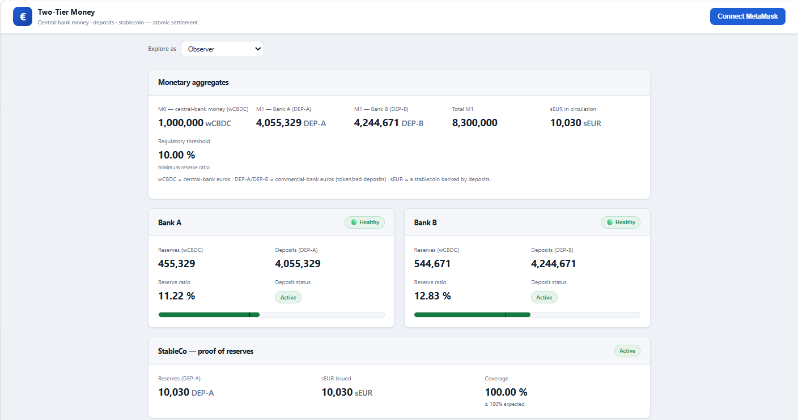
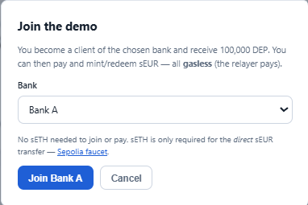
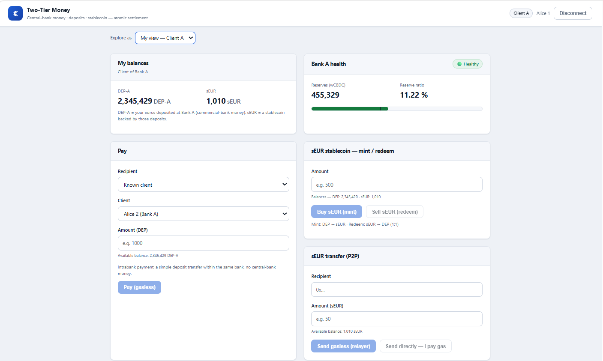
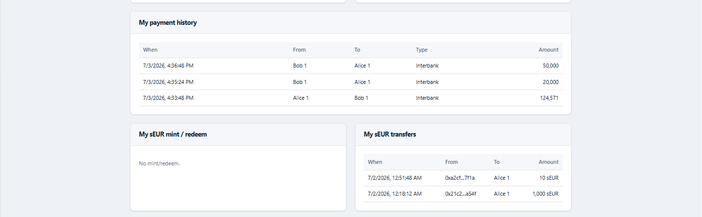
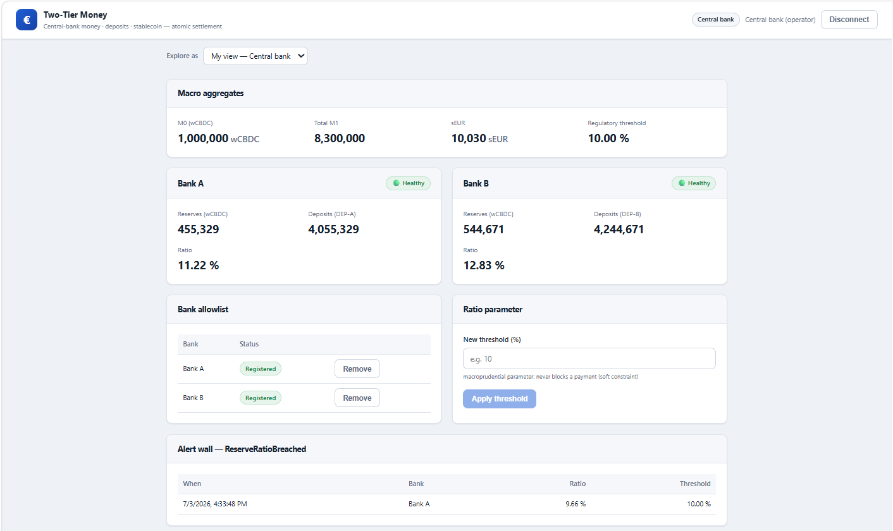
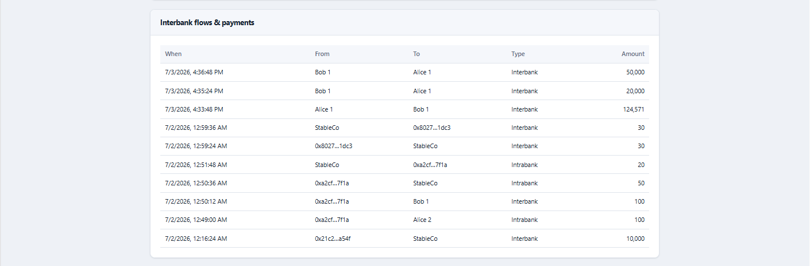
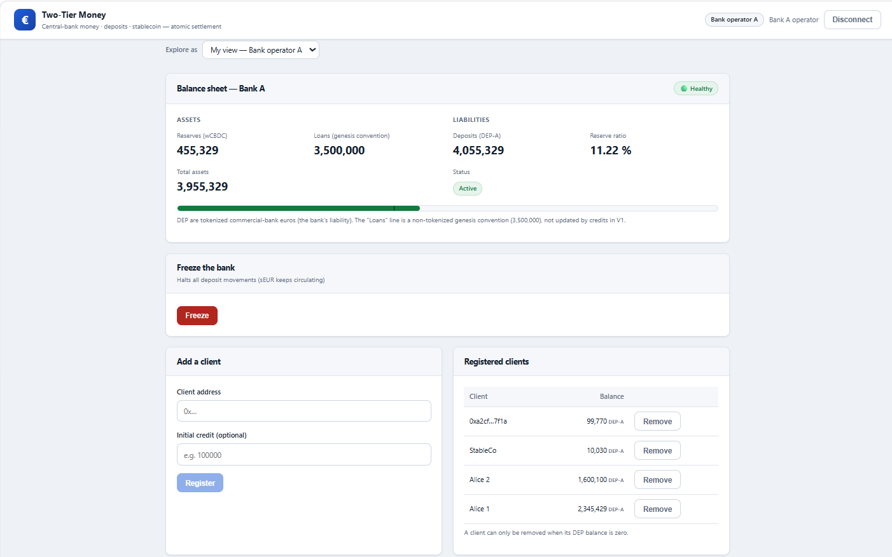
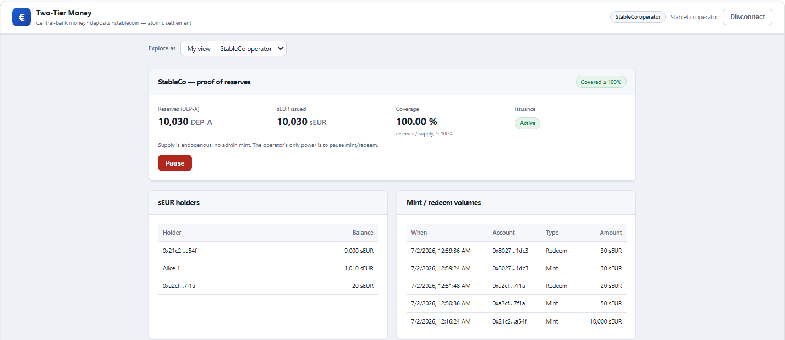

# Two-Tier Money

> **scriptura** — from the French *monnaie scripturale*, "book money": money that exists
> as ledger entries in banks' books. This project puts those ledger entries on-chain.

An on-chain simulation of the **two-tier monetary system**: tokenized central bank money
(wCBDC), tokenized commercial bank deposits (DEP-A / DEP-B), and a fiat-backed stablecoin
(sEUR) whose reserves are those deposits — with **atomic interbank settlement in central
bank money**, gasless EIP-712 payment intents, a Foundry invariant suite, and a role-based
dashboard (client, bank operator, stablecoin issuer, central bank, observer).


**Status: V1 — feature-complete**, deployed & Etherscan-verified on Sepolia, validated
end-to-end on the live deployment. V2+ (crisis scenarios, lender of last resort, AMM,
multi-chain) is designed but deliberately not built — see [Roadmap](#roadmap).



*The public observer dashboard — the whole system at a glance, readable without connecting
a wallet: monetary aggregates (M0, M1 per bank, sEUR in circulation), each bank's health
badge and reserve-ratio gauge, and StableCo's live proof of reserves.*

## What it demonstrates

- **The singleness of money.** A euro at Bank A equals a euro at Bank B *because* every
  interbank transfer settles in central bank money: burn DEP-A → move wCBDC → mint DEP-B,
  in **one transaction**.
- **Fractional-reserve fragility.** The soft constraint (ratio breach → event, payments
  continue) is separated from the hard one (insufficient wCBDC → revert): bank stress is
  gradual and observable — HEALTHY 🟢 / STRESSED 🟠 / ILLIQUID 🔴.
- **TradFi → stablecoin contagion.** sEUR is 100% backed by deposits at Bank A: freeze
  the bank and redemptions break while sEUR keeps circulating (the USDC/SVB 2023 pattern).
- **Endogenous stablecoin supply.** No admin mint exists; coverage ≥ 100% is a tested
  invariant and proof of reserves is a view call.
- **Intermediated vs permissionless money.** DEP is registry-gated and freezable; sEUR
  moves gasless (EIP-3009) or wallet-direct, even when the infrastructure is down.

## Live on Sepolia

All 9 instances deployed by one `make deploy-sepolia`, sources verified on Etherscan
(chain id 11155111 — see [`deployments/sepolia.json`](deployments/sepolia.json)):

| Contract | Address | Role |
|---|---|---|
| CentralBank | [`0x2fa4…367C`](https://sepolia.etherscan.io/address/0x2fa41B31ffC3AE854894F0B833aBB4d405dc367C#code) | M0 issuance, bank allowlist, ratio threshold |
| wCBDC | [`0xF4dA…2D05`](https://sepolia.etherscan.io/address/0xF4dA1121c405Ae259D86B4c9714318ec66c82D05#code) | Central bank money (banks only) |
| Bank A | [`0x0B3C…B431`](https://sepolia.etherscan.io/address/0x0B3CFC3A2FeE422c96cE9008aad8eea99548B431#code) | Reserves, client registry, freeze |
| DEP-A | [`0x41E3…Ff23`](https://sepolia.etherscan.io/address/0x41E38ED1430c2e1e8c8C5A53c76Cc65524c7Ff23#code) | Bank A's tokenized deposits |
| Bank B | [`0x486C…977a`](https://sepolia.etherscan.io/address/0x486CB34cEf6ee6172146E12040aD427964d7977a#code) | Reserves, client registry, freeze |
| DEP-B | [`0xd666…14a9`](https://sepolia.etherscan.io/address/0xd666f15c56a947858319CA94AA99a9E6d1A314a9#code) | Bank B's tokenized deposits |
| SettlementEngine | [`0x7838…5c06`](https://sepolia.etherscan.io/address/0x78387124C775487688D72721F5f9159DfF745c06#code) | EIP-712 intents, atomic settlement |
| StableCo | [`0x5c48…6D24`](https://sepolia.etherscan.io/address/0x5c4849266349d952e98C5A0Fa6d28A1648416D24#code) | Reserve vault, sEUR mint/redeem |
| sEUR | [`0x4bC5…E797`](https://sepolia.etherscan.io/address/0x4bC5939bbF813f35C2f6Ae53cfdb0e32Ec2DE797#code) | Permissionless stablecoin + EIP-3009 |

Reference transactions from the end-to-end run on the live deployment:

| Flow | Tx |
|---|---|
| Interbank payment — wCBDC settles the exact amount | [`0x353d…bd9c`](https://sepolia.etherscan.io/tx/0x353d57e3d9122827c60015d4811a9e94bbd146cb534ea1e72c92f2debb82bd9c) |
| **Cross-bank sEUR mint** — burn DEP-B → wCBDC B→A → mint DEP-A to the vault → mint sEUR, one tx | [`0x2479…6fb4`](https://sepolia.etherscan.io/tx/0x2479416390635aaa779b5e44671fb8b76ee906e9e3c98a5806afc231f1176fb4) |
| **Cross-bank sEUR redeem** — the composed mirror (A→B) | [`0x9efa…6dba`](https://sepolia.etherscan.io/tx/0x9efa70987de35966b4b5bc67ded47502e0a7f6c378df9fbc1d734c0d02916dba) |
| Gasless sEUR transfer (EIP-3009, relayer pays gas) | [`0x8634…e6d2`](https://sepolia.etherscan.io/tx/0x8634ea701d8636c9885ccb665a39fe7c4e311c6ab6acf5c60a4577a09e8fe6d2) |

## Engineering highlights

- **7 monetary invariants** fuzzed with Foundry invariant testing (`fail_on_revert`,
  production signing paths — real EIP-712 signatures, third-party submitter).
- **Gasless by signature, trustless by contract**: a stateless relayer pays gas, the
  contracts re-verify everything; the engine is relay-agnostic, so censorship is
  operational, never contractual.
- **Three anti-replay nonce namespaces**, deliberately not unified (sequential engine +
  sequential StableCo + random EIP-3009).
- **Composed cross-bank flows**: a Bank B client minting sEUR moves value across all
  three monetary layers atomically, with coverage provably ≥ 100% at every step.
- **No database anywhere**: the chain is the source of truth — the relayer re-derives its
  state at boot, the indexer is a rebuildable projection, the frontend stores nothing.

## Architecture

```
              MetaMask (client keys: EIP-712/3009 signing · operator direct txs)
                                       │
                       ┌───────────────┴────────────────┐
                       │  Frontend — Vite + React/wagmi │  :5173
                       └──┬────────────┬────────────┬───┘
             POST /intent │            │ GET /…     │ live reads (viem)
             POST /faucet │            │            │
                ┌─────────▼──────┐  ┌──▼──────────┐ │
                │ Relayer        │  │ Indexer     │ │
                │ Fastify + viem │  │ Ponder+Hono │ │
                └─────────┬──────┘  └──▲──────────┘ │
                    txs   │            │ eth_getLogs│
                          ▼            │            ▼
       ┌───────────────────────────────┴──────────────────────────┐
       │        Chain (Anvil dev / Sepolia live) — source of truth │
       │   CentralBank──wCBDC    Bank A──DEP-A    Bank B──DEP-B    │
       │   SettlementEngine      StableCo──sEUR                    │
       └───────────────────────────────────────────────────────────┘
```

## Quickstart

Prerequisites: [Foundry](https://getfoundry.sh), Node.js ≥ 20, GNU Make, MetaMask.

```bash
git clone --recurse-submodules https://github.com/TheBossMickael/scriptura
cd scriptura
cp .env.example .env
(cd relayer  && npm install)
(cd indexer  && npm install)
(cd frontend && npm install)
```

### See it live (Sepolia)

The committed deployment already carries real state and history — start there. The app is
**three services** (relayer, indexer, front); against the live deployment you run two of
them. Set `VITE_CHAIN="sepolia"` in `.env`, then:

```bash
make front                    # dashboards on http://localhost:5173, live Sepolia data
CHAIN=sepolia make indexer    # history walls & lists (public RPC pool preconfigured)
```

That gives you every dashboard read-only on live on-chain data, plus direct sEUR
transfers with your own gas. The third service — the relayer, which powers every gasless
action — authenticates as the deployment's relayer EOA, whose key stays with the
operator. For the full three-service experience: run everything locally (next section,
five minutes), deploy your own Sepolia instance (`make deploy-sepolia` with your own
keys/RPC regenerates `deployments/sepolia.json`), or open an issue to ask for a live run.

### Run everything locally

The fully interactive stack — gasless payments, faucet onboarding, freezes. **Nothing to
configure**: the `.env` you copied already contains everything for local
(`VITE_CHAIN="local"` plus Anvil's well-known, pre-funded test keys for every role — no
real value ever touches them). Anvil, bundled with Foundry, is the supported local chain:
the genesis scripts key on its chain id (31337) and its pre-funded accounts. Four
terminals:

```bash
make anvil            # 1 — local chain
make deploy-local     # 2 — deploy + seed the full genesis (run once), then:
make relayer          # 2 — gasless relayer on :3001
make indexer          # 3 — indexer + REST API on :42069
make front            # 4 — app on http://localhost:5173
```

All three services must be up for the full experience: the relayer powers every gasless
action, the indexer powers the history sections. Point MetaMask at `localhost:8545`
(chain id 31337) and import a genesis client key from `.env` (e.g. alice1) — or connect
any wallet and use **Join**.

## Try it with your own wallet

The demo is designed so a visitor can **act, not just watch**: connect an unknown wallet
and the observer view offers **Join / get test euros** — the relayer (holding a narrow
on-chain `FAUCET_ROLE`: register + capped credit, one-shot per address, nothing else)
onboards you as a bank client. From there everything runs gasless with your own
signatures: pay intrabank/interbank, mint and redeem sEUR (including the cross-bank
composed flow), transfer sEUR P2P. This needs the stack running (relayer + indexer +
front) — the local setup above gives you exactly that.



## Screenshots

Each dashboard is what the app resolves for the connected account's **on-chain role** —
the shots below were taken connected as the actual client/operator accounts, on live
Sepolia data. You don't need those keys to see the same screens: the **"Explore as"**
dropdown (top of the app) lets anyone browse every view read-only.

**Client** — connected as a Bank A client: balances, the bank's live health (the panic
signal), gasless payment, sEUR mint/redeem and both P2P paths — then the personal history.

| | |
|---|---|
|  |  |

**Central bank** — connected as the central-bank operator: macro aggregates, per-bank
monitors, allowlist and threshold controls, the `ReserveRatioBreached` alert wall (note
the real breach at 9.66%) — and every interbank flow, including StableCo's composed
settlements.

| | |
|---|---|
|  |  |

**Bank operator and StableCo** — the live two-column balance sheet with its ratio gauge
and freeze switch; the issuer's proof of reserves with its coverage badge.

| | |
|---|---|
|  |  |

## Known limitations (documented, not hidden)

- **Indexer history lags ~30 s–2 min** behind the head on Sepolia (public RPC pool, 15 s
  polling); live balances are direct RPC reads and stay instant.
- **Amount inputs parse commas as en-US thousands separators**: `1,500` = 1500.
- **The relayer is a single point of failure — on purpose** (real settlement systems have
  the same shape); mitigations and analysis in [docs/threat-model.md](docs/threat-model.md).
- **Sequential nonces allow one in-flight action per client** — the UI locks buttons
  until confirmation.
- **Testnet-grade key handling**: throwaway keys in a gitignored `.env`; the production
  posture (encrypted keystore) is documented, not implemented.

## Tests

**155 Foundry tests** (132 unit · 17 integration · 6 invariant properties, 128 runs ×
depth 64, zero tolerated reverts) + **25 relayer** and **25 frontend** vitest suites —
plus a full E2E user simulation, green against the live Sepolia deployment.

```bash
make test
```

## Documentation

| Doc | What's inside |
|---|---|
| [docs/monetary-design.md](docs/monetary-design.md) | The "why": two-tier money, singleness, hard vs soft constraints, MiCA/RTGS/unified-ledger anchors |
| [docs/architecture.md](docs/architecture.md) | The "how": contracts, roles, flows, keys, RPC strategy — plus the phase-by-phase build history |
| [docs/contracts.md](docs/contracts.md) | Per-contract reference; EIP-712 domains; the invariants ↔ code ↔ tests map |
| [docs/scenarios.md](docs/scenarios.md) | 12 numbered walk-throughs, each tied to its integration test and, where applicable, a live Sepolia tx |
| [docs/threat-model.md](docs/threat-model.md) | Powers & blast radius, attack surfaces, the assumed SPOF |
| [docs/frontend.md](docs/frontend.md) | Role views, blocking UX, pre-simulation, chain pinning |
| [docs/indexer.md](docs/indexer.md) | Derived-store design, REST API — and the field note on RPC getLogs caps |
| [docs/project.md](docs/project.md) | The consolidated blueprint: actors, mechanisms, genesis, stack decisions, roadmap |

## Roadmap

V1 (this release) is the deliverable. The design leaves explicit hooks for:

- **V2 — crisis & liquidity**: orchestrated bank-run / depeg / relayer-outage scenarios,
  interbank lending, refinancing + lender of last resort, SIWE-protected scenario controls.
- **V3 — markets & policy**: an sEUR/DEP AMM (a real market price → observable depeg),
  remunerated reserves, credit creation.
- **V4 — multi-chain**: the L1 as settlement layer, one rollup per commercial bank,
  cross-chain settlement via HTLCs and intents.

## License

[MIT](LICENSE) — © 2026 Mickael Osorio.
